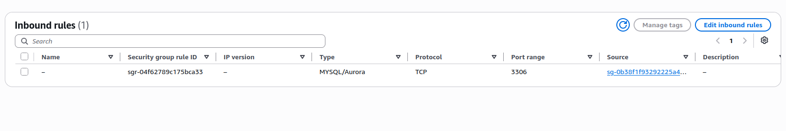
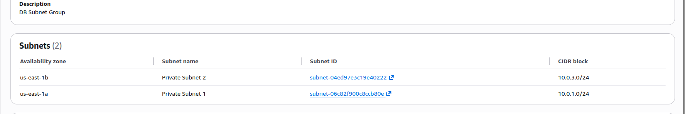
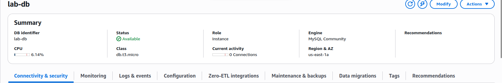
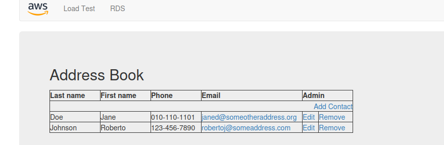

# Amazon RDS MySQL Database Lab

## Project Overview

In this project, I created a highly available MySQL database using Amazon RDS and connected it to a web application running on an Amazon EC2 instance.

The web application used the RDS database to store and manage Address Book contact information.

## Architecture

```text
Web Application on EC2
          |
          | MySQL TCP port 3306
          |
Amazon RDS MySQL
    Multi-AZ Deployment
```

## AWS Services Used

- Amazon RDS
- Amazon EC2
- Amazon VPC
- AWS Security Groups
- DB Subnet Groups
- MySQL

## Tasks Completed

### 1. Created a Database Security Group

I created a security group called `DB Security Group`.

The inbound rule allows:

- Type: MySQL/Aurora
- Protocol: TCP
- Port: 3306
- Source: Web Security Group

This allows only the web server to communicate with the database.



### 2. Created a DB Subnet Group

I created a DB subnet group using two private subnets in different Availability Zones:

- Private Subnet 1 — us-east-1a
- Private Subnet 2 — us-east-1b

Using subnets in two Availability Zones supports a Multi-AZ database deployment.



### 3. Created an Amazon RDS MySQL Instance

I created an Amazon RDS database with the following configuration:

- Database identifier: `lab-db`
- Database engine: MySQL
- Instance class: `db.t3.micro`
- Storage: General Purpose SSD
- Deployment: Multi-AZ
- Initial database name: `lab`

Sensitive information such as passwords and database endpoints is not included in this repository.



### 4. Connected the Web Application to RDS

I configured the web application to connect to the RDS MySQL database.

After the connection was established, the application imported the Address Book database structure and displayed saved contacts.

I tested the application by:

- Adding a contact
- Editing a contact
- Removing a contact



## Troubleshooting

The web application initially failed to connect to the database.

The username entered in the application did not match the RDS master username.

After entering the correct database username, the application connected successfully.

## Security Practices

The following sensitive information is excluded from this repository:

- AWS account ID
- AWS access keys
- AWS secret access keys
- Session tokens
- Database passwords
- RDS endpoint
- Private key files

## Result

The EC2 web application successfully connected to the Amazon RDS MySQL database and performed create, update, and delete operations on the Address Book data.