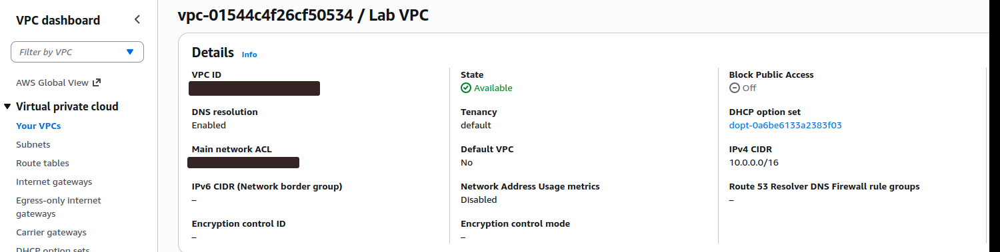
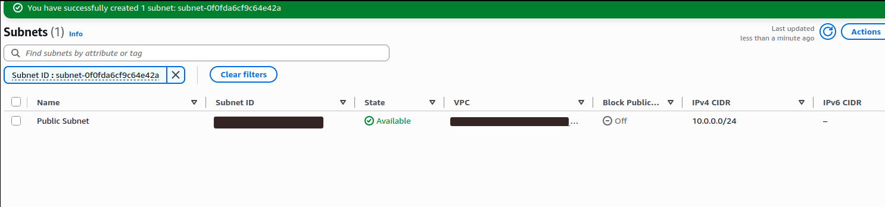
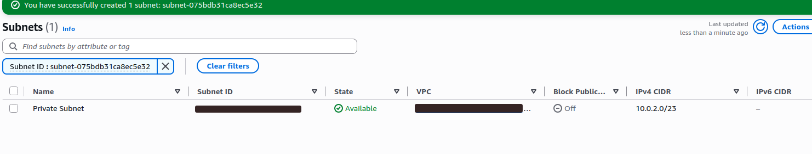
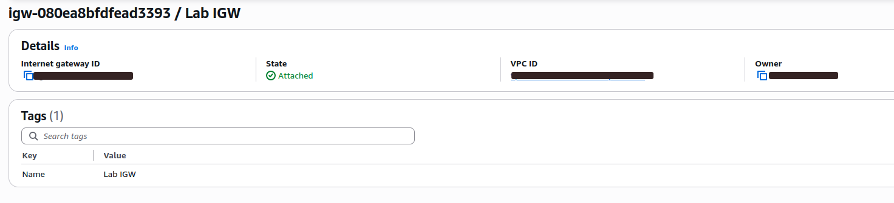
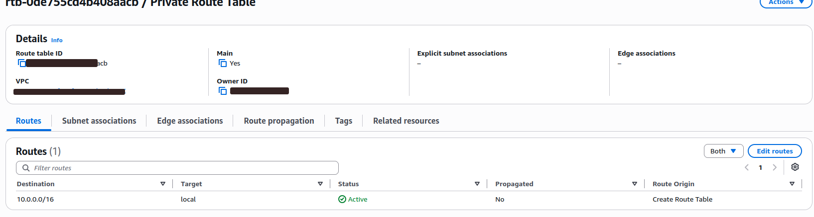
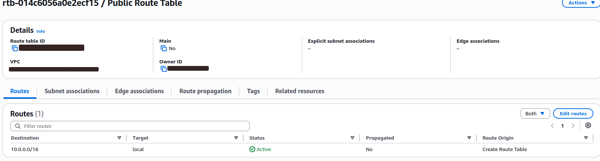
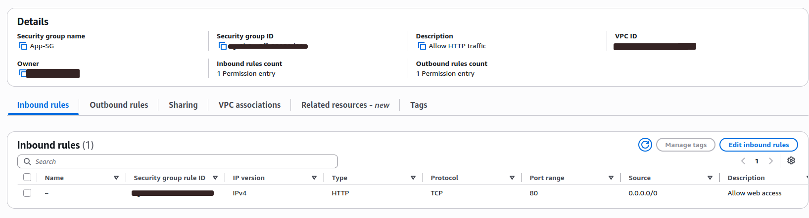
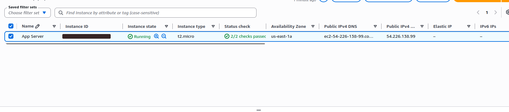
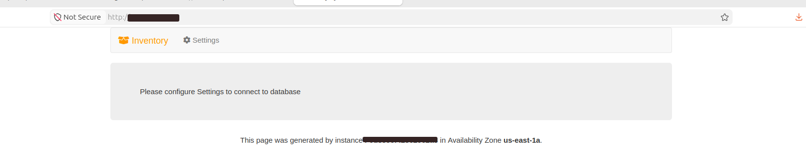
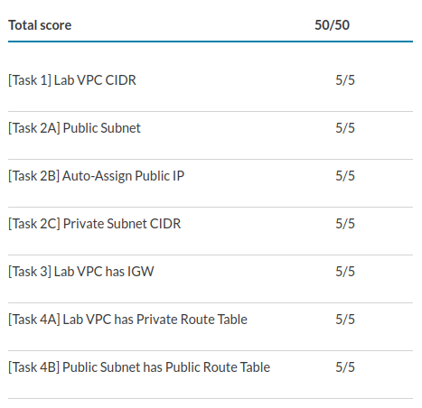

# AWS VPC Networking Lab

This project demonstrates the creation of a custom network infrastructure in Amazon Web Services using Amazon VPC.

## Final Result

- Lab score: **50/50**
- EC2 instance status: **Running**
- Status checks: **2/2 passed**
- Inventory web application successfully accessed through the internet

## Architecture

The infrastructure contains:

- Custom VPC
- Public subnet
- Private subnet
- Internet Gateway
- Public and private route tables
- Security group
- EC2 application server
- Apache web server

## Network Configuration

| Resource | Configuration |
|---|---|
| VPC | `10.0.0.0/16` |
| Public Subnet | `10.0.0.0/24` |
| Private Subnet | `10.0.2.0/23` |
| Public Route | `0.0.0.0/0` through Internet Gateway |
| Security Group | HTTP TCP port `80` |
| EC2 Instance | Amazon Linux 2023, `t2.micro` |
| Web Server | Apache HTTP Server |

## Implementation Steps

1. Created a custom VPC named `Lab VPC`.
2. Enabled DNS resolution and DNS hostnames.
3. Created a public subnet.
4. Enabled automatic public IPv4 assignment.
5. Created a private subnet.
6. Created and attached an Internet Gateway.
7. Configured private and public route tables.
8. Added an internet route to the public route table.
9. Associated the public subnet with the public route table.
10. Created a security group allowing HTTP traffic on port 80.
11. Launched an EC2 application server.
12. Installed Apache using EC2 user data.
13. Verified the Inventory application through a web browser.

## Screenshots

### Lab VPC

### Public Subnet

### Private Subnet

### Internet Gateway

### Private Route Table

### Public Route Table

### Security Group

### EC2 Application Server

### Inventory Application

### Final Lab Score

## Security

Sensitive information was removed from screenshots, including:

- AWS Account ID
- Public IPv4 address
- Public DNS name
- EC2 instance ID
- Access keys
- Secret keys
- Passwords and credentials

## Skills Demonstrated

- Amazon VPC
- CIDR configuration
- Public and private subnets
- Internet Gateway
- Route tables
- Security groups
- Amazon EC2
- Linux user data
- Apache web server
- AWS network security
