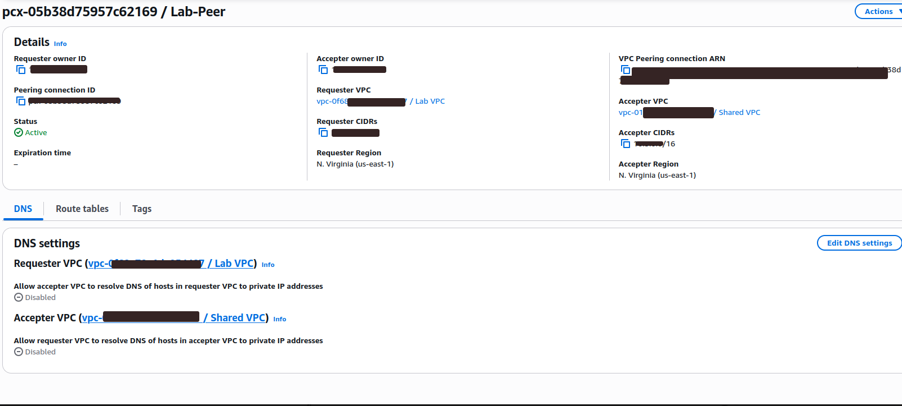
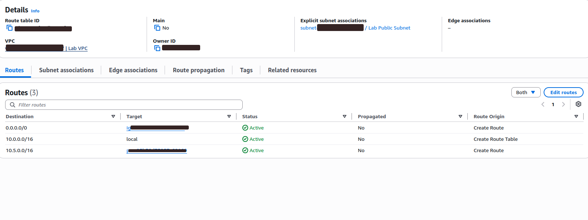
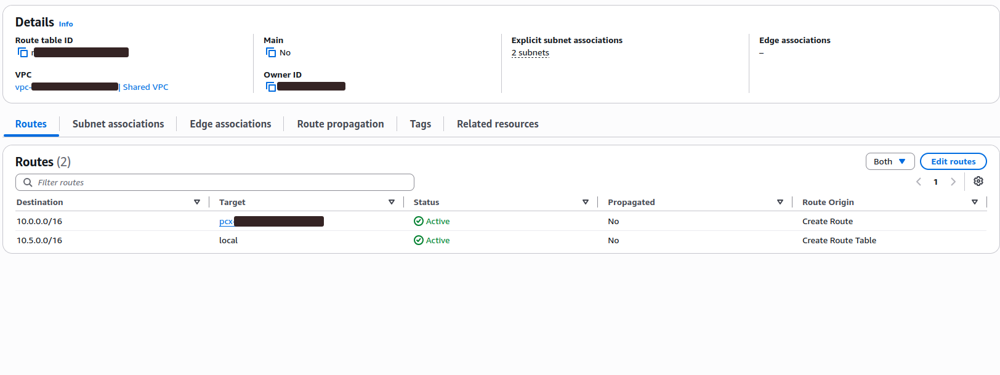
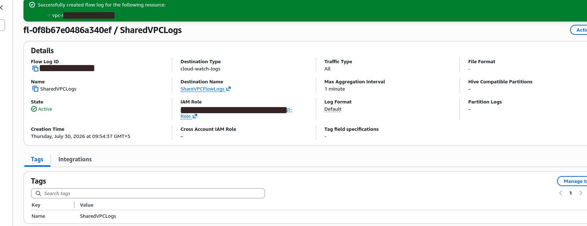
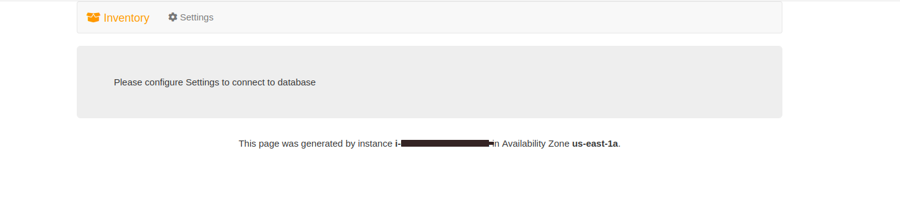
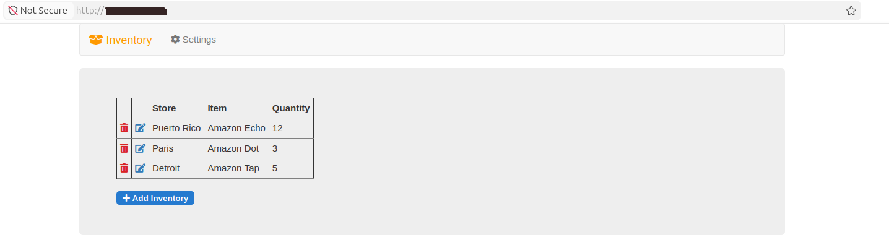
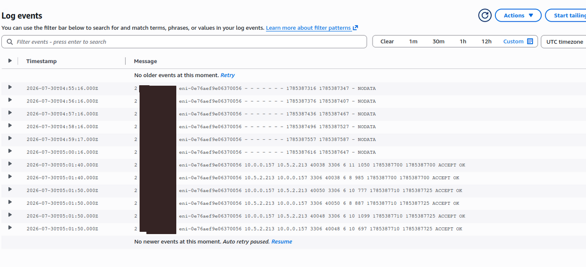
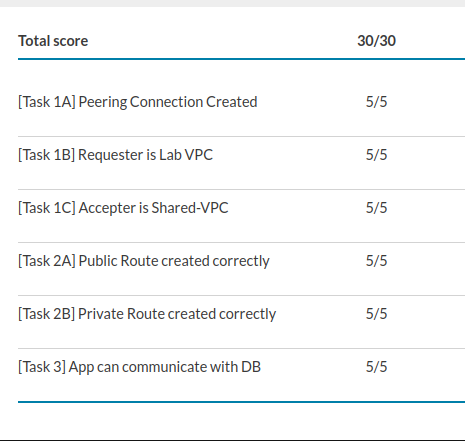

# AWS VPC Peering Connection Lab

This project demonstrates how to establish private communication between two Amazon Virtual Private Clouds using an AWS VPC Peering Connection.

## Project Objectives

- Create a VPC peering connection between two VPCs
- Configure route tables for bidirectional communication
- Enable VPC Flow Logs
- Connect an EC2-hosted inventory application to a database in another VPC
- Analyze database traffic in Amazon CloudWatch
- Verify successful communication over TCP port 3306

## Architecture Overview

The lab environment contained two VPCs:

| VPC | CIDR Block | Purpose |
|---|---|---|
| Lab VPC | `10.0.0.0/16` | Hosts the EC2 inventory application |
| Shared VPC | `10.5.0.0/16` | Hosts the database in a private subnet |

The two VPCs were connected through a VPC peering connection named `Lab-Peer`.

## Implementation Steps

### 1. Created and accepted the VPC peering connection

The peering connection was created between Lab VPC and Shared VPC and reached the `Active` state.

### 2. Configured the Lab VPC route table

A route was added to the Lab Public Route Table:

- Destination: `10.5.0.0/16`
- Target: `Lab-Peer`

### 3. Configured the Shared VPC route table

A reverse route was added to the Shared VPC route table:

- Destination: `10.0.0.0/16`
- Target: `Lab-Peer`

### 4. Enabled VPC Flow Logs

VPC Flow Logs were enabled for Shared VPC with the following configuration:

- Flow log name: `SharedVPCLogs`
- Traffic type: `All`
- Destination: Amazon CloudWatch Logs
- Log group: `ShareVPCFlowLogs`
- Maximum aggregation interval: `1 minute`

### 5. Tested the application before database configuration

Before configuring the database connection, the inventory application displayed a database configuration message.

### 6. Connected the inventory application to the database

After entering the database endpoint and credentials, the inventory application successfully retrieved records from the database located in Shared VPC.

### 7. Analyzed traffic with CloudWatch Logs

CloudWatch VPC Flow Logs confirmed communication between the application and database.

The logs showed:

- Lab VPC private IP: `10.0.0.157`
- Shared VPC database private IP: `10.5.2.213`
- Database port: `3306`
- Action: `ACCEPT`
- Log status: `OK`

## Final Result

The VPC peering connection and routing configuration worked successfully. The EC2 inventory application communicated privately with the database in Shared VPC.

The lab was completed with a score of **30/30**.

## AWS Services Used

- Amazon VPC
- VPC Peering
- Amazon EC2
- Amazon CloudWatch Logs
- VPC Flow Logs
- Route Tables
- AWS Identity and Access Management

## Security

Sensitive information such as AWS account IDs, public IP addresses, resource IDs, and credentials has been hidden from the screenshots.

## Author

Sarvinoz
