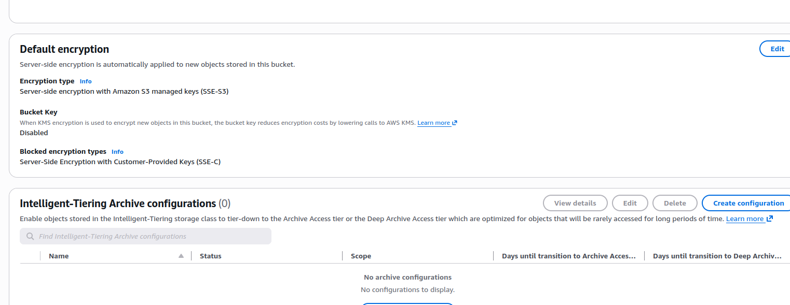
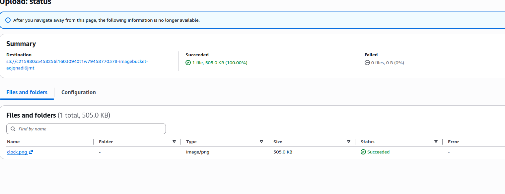
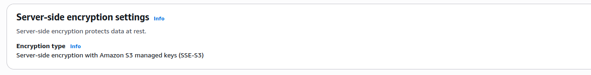
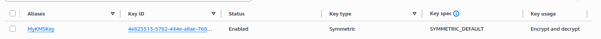
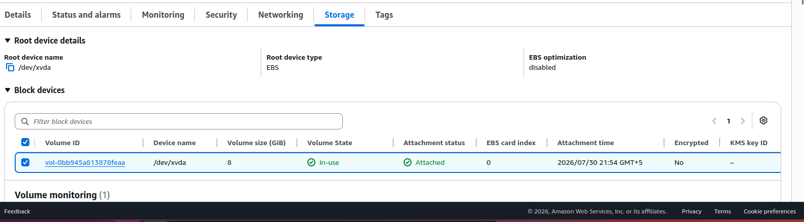
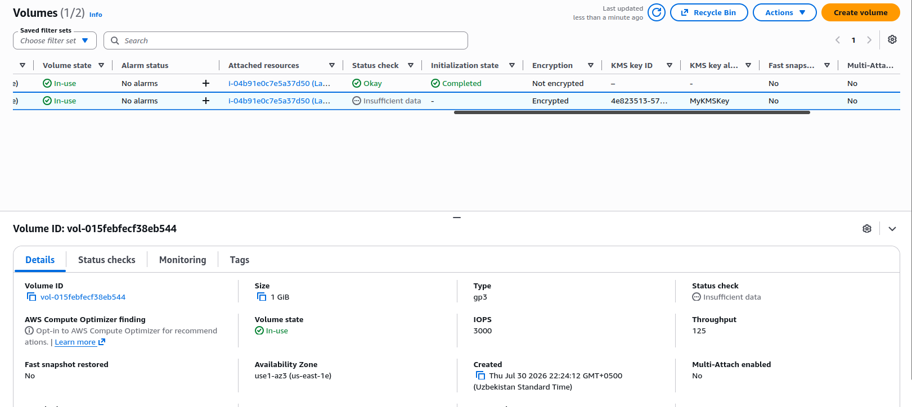
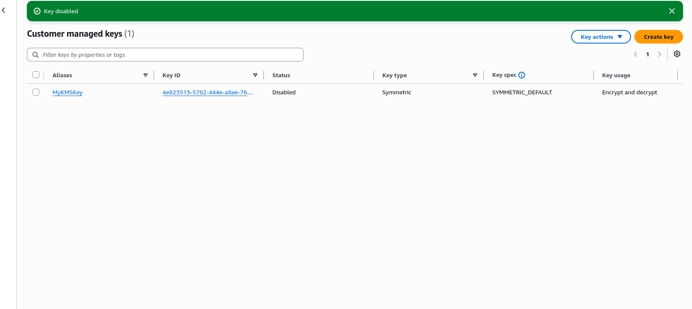
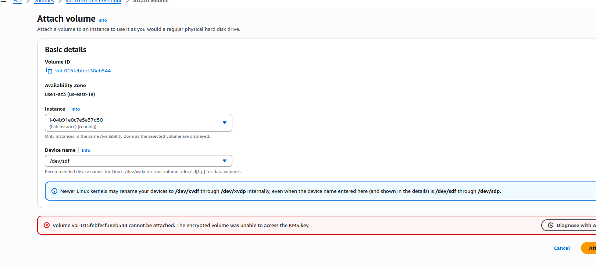
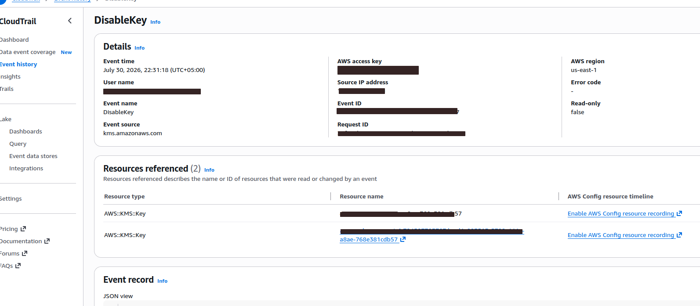

# AWS Data Encryption at Rest Lab

## Lab Overview

This guided lab demonstrates how AWS protects data at rest by using Amazon S3 server-side encryption, AWS Key Management Service (AWS KMS), encrypted Amazon EBS volumes, and AWS CloudTrail audit logs.

The lab also demonstrates what happens when the KMS key used by an encrypted EBS volume is disabled.

## Objectives

After completing this lab, I was able to:

- Review Amazon S3 default encryption.
- Upload and access an encrypted S3 object.
- Create an AWS KMS customer managed key.
- Create an encrypted EBS data volume.
- Attach the encrypted volume to an EC2 instance.
- Disable and re-enable a KMS key.
- Observe how disabling the key affects encrypted volume access.
- Analyze KMS activity with AWS CloudTrail.
- Enable automatic KMS key rotation.

## AWS Services Used

- Amazon S3
- AWS Key Management Service (AWS KMS)
- Amazon EC2
- Amazon Elastic Block Store (Amazon EBS)
- AWS CloudTrail

## Task 1: Review Amazon S3 Default Encryption

The S3 bucket was configured with server-side encryption using Amazon S3 managed keys (SSE-S3).



The `clock.png` object was uploaded successfully.



The uploaded object was automatically encrypted with SSE-S3.



Although the object was encrypted at rest, Amazon S3 transparently decrypted it when it was accessed through its object URL.


## Task 2: Create an AWS KMS Key

A symmetric customer managed KMS key named `MyKMSKey` was created for encryption and decryption operations.



## Task 3: Create and Attach an Encrypted EBS Volume

The existing EC2 root volume was not encrypted.



A new 1 GiB EBS volume was created, encrypted with `MyKMSKey`, and attached to the EC2 instance.



## Task 4: Disable the KMS Key and Observe the Effect

The KMS key was temporarily disabled.



After detaching the encrypted EBS volume, attempting to attach it again failed because the volume could not access the disabled KMS key.



AWS CloudTrail recorded the `DisableKey` event.



CloudTrail also recorded the failed `AttachVolume` request with the error:

```text
Client.CustomerKeyHasBeenRevoked

The KMS key was then re-enabled.

After the key was enabled, the encrypted EBS volume was successfully attached again.

Task 5: Analyze KMS Activity with CloudTrail

The CreateGrant event showed that permission was created for the AWS service to use the KMS key.

The Decrypt event showed the encrypted data key being decrypted so the EC2 instance could access the encrypted EBS volume.

The GenerateDataKeyWithoutPlaintext event showed that AWS KMS generated an encrypted data key when the encrypted EBS volume was created.

Task 6: Enable Automatic Key Rotation

Automatic key rotation was enabled for MyKMSKey with a rotation period of 365 days.

Security Notes

Sensitive information in the CloudTrail screenshots was hidden before being added to this repository, including:

AWS access key information
Source IP addresses
User names
AWS account identifiers
Event and request identifiers
Full resource ARNs
Final Result

The lab was completed successfully with a score of 25/25.

Key Takeaways
Amazon S3 encrypts new objects at rest by default.
AWS KMS provides centralized control over encryption keys.
Encrypted EBS volumes require access to their associated KMS keys.
Disabling a KMS key can prevent encrypted resources from being accessed.
AWS CloudTrail records KMS and EC2 API activity for auditing and investigation.
Automatic key rotation helps improve long-term key security.
