cat > 09-decoupled-applications-sqs-sns/README.md <<'EOF'
# Building Decoupled Applications with Amazon SQS and SNS

## Overview

This project demonstrates how to transform a tightly coupled image-processing application into a decoupled and more reliable architecture by using Amazon SQS and Amazon SNS.

The application accepts PNG images, stores them in Amazon S3, processes them into resized and tinted images, and tracks processing information in Amazon DynamoDB.

The lab was completed in two phases:

- **Phase 1:** Tightly coupled architecture
- **Phase 2:** Decoupled architecture using Amazon SQS and Amazon SNS

## Objectives

- Review how an image-processing web application works
- Configure Amazon S3 bucket permissions
- Configure S3 event notifications
- Create an Amazon SNS topic
- Create an Amazon SQS queue
- Subscribe Amazon SQS to an SNS topic
- Configure an SNS email subscription
- Implement SQS polling
- Compare tightly coupled and decoupled architectures

## AWS Services Used

- Amazon EC2
- Amazon S3
- Amazon DynamoDB
- Amazon Simple Queue Service — SQS
- Amazon Simple Notification Service — SNS
- AWS IAM
- Node.js

---

## Phase 1: Tightly Coupled Architecture

In Phase 1, the web server communicates directly with the application server.

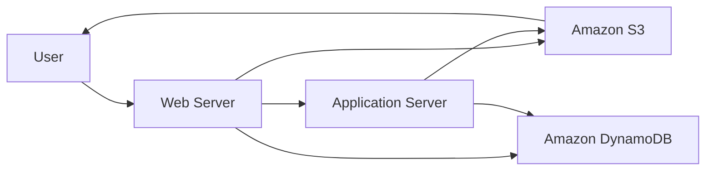

### Workflow

1. The user uploads an image through the web application.
2. The web server stores the original image in Amazon S3.
3. Image metadata and processing status are stored in DynamoDB.
4. The web server directly calls the application server.
5. The application server resizes and tints the image.
6. The processed image is uploaded back to Amazon S3.
7. The browser displays the completed image.

### Lab IDE

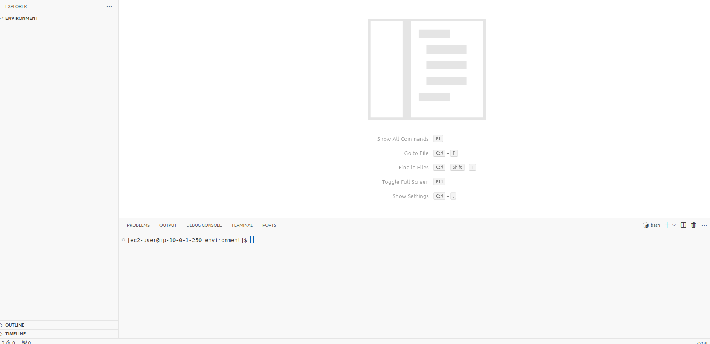

### Phase 1 S3 Permissions

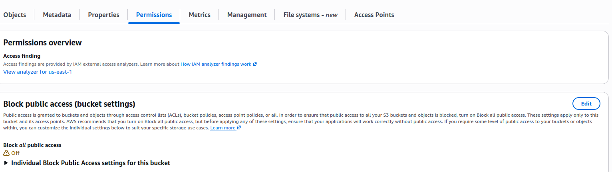

### Phase 1 Bucket Policy

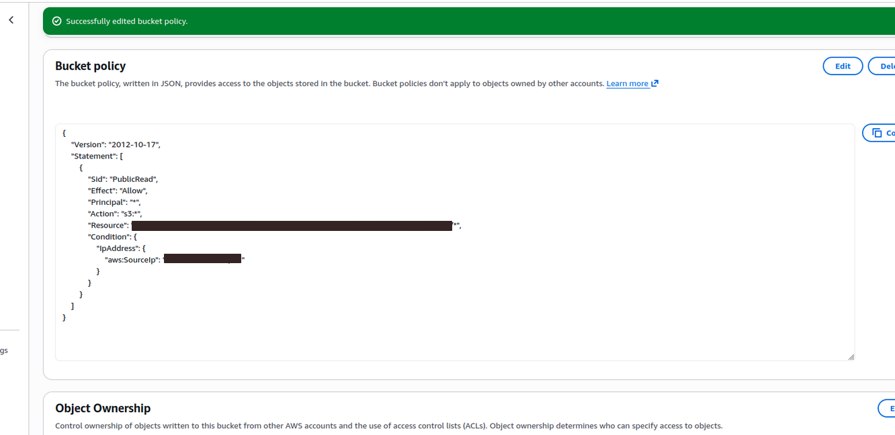

### Image Tinter Application

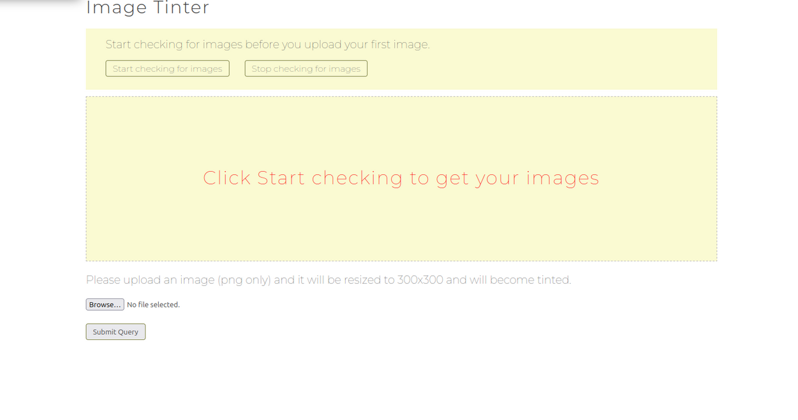

### Processed Image

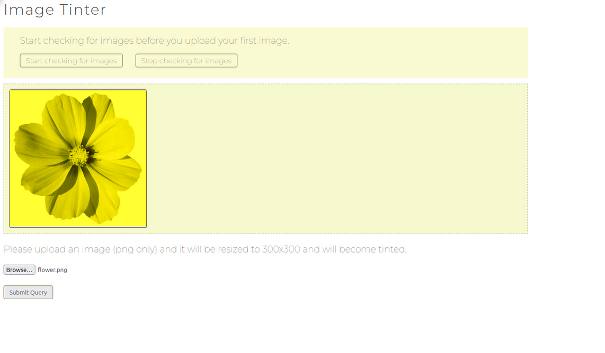

### Phase 1 Analysis

The web server and application server are tightly coupled. The web server must wait for the application server to complete image processing.

If the application server becomes unavailable, the entire image-processing workflow can fail.

---

## Phase 2: Decoupled Architecture

In Phase 2, Amazon SNS and Amazon SQS are introduced between the storage and processing components.

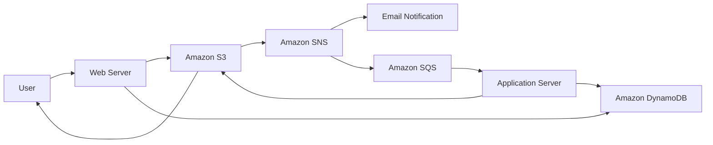

### Decoupled Workflow

1. The user uploads an image through the improved web application.
2. The web server stores the image in the Phase 2 S3 bucket.
3. Amazon S3 sends an event notification to Amazon SNS.
4. Amazon SNS sends the message to the SQS queue and the subscribed email address.
5. The application server polls the SQS queue.
6. The application server receives the image information.
7. The original image is downloaded from Amazon S3.
8. The image is resized and tinted.
9. The processed image is saved back to Amazon S3.
10. DynamoDB processing status is updated.
11. The browser displays the completed image.

## Amazon SQS Queue

A Standard SQS queue named `ImageApp` was created to store image-processing messages.

Messages remain in the queue until the application server is available to process them.

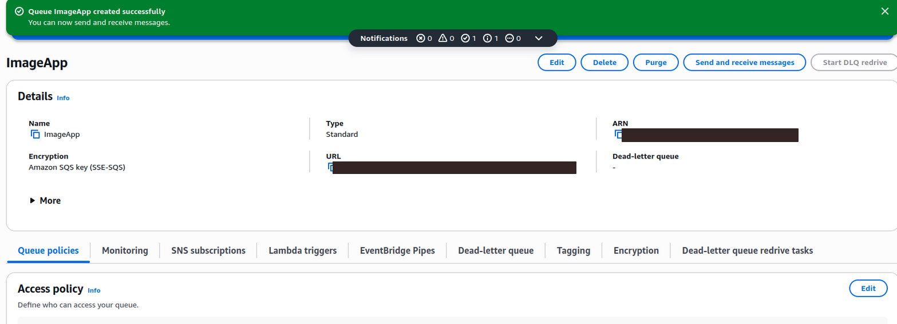

## Amazon SNS Topic

An SNS topic named `uploadnotification` was created.

The SNS topic receives Amazon S3 event notifications and distributes messages to multiple subscribers:

- Amazon SQS
- Email

## Phase 2 S3 Permissions

Public access blocking was disabled for the lab bucket, and access was restricted through a bucket policy.

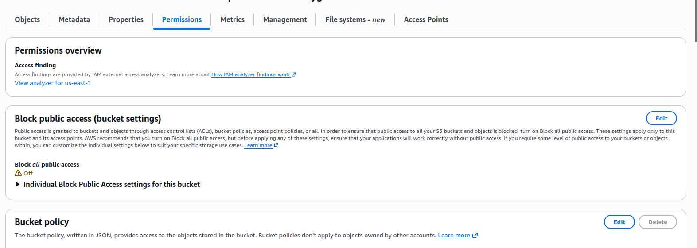

## Phase 2 Bucket Policy

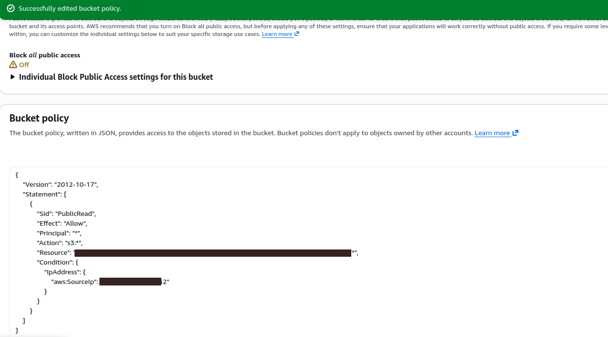

## S3 Event Notification

An event notification named `SendtoSns` was configured for all object creation events.

```text
Amazon S3 → Amazon SNS
```


## SNS to SQS Subscription

The `ImageApp` SQS queue was subscribed to the `uploadnotification` SNS topic.

```text
Amazon SNS → Amazon SQS
```

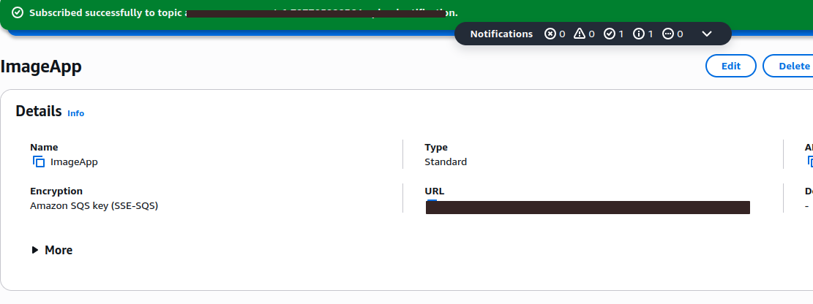

## SNS Email Subscription

An email endpoint was subscribed to the SNS topic and successfully confirmed.

```text
Amazon SNS → Email
```

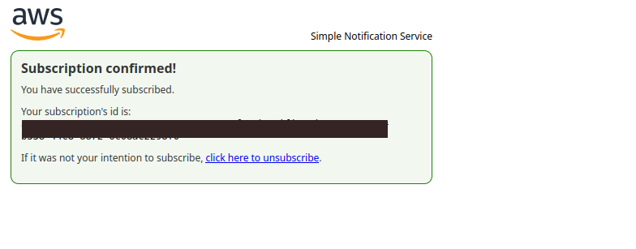

---

## Testing the Improved Application

The improved application runs on a separate web-server port and includes controls for:

- Looking up images
- Uploading images
- Polling the SQS queue
- Stopping SQS polling

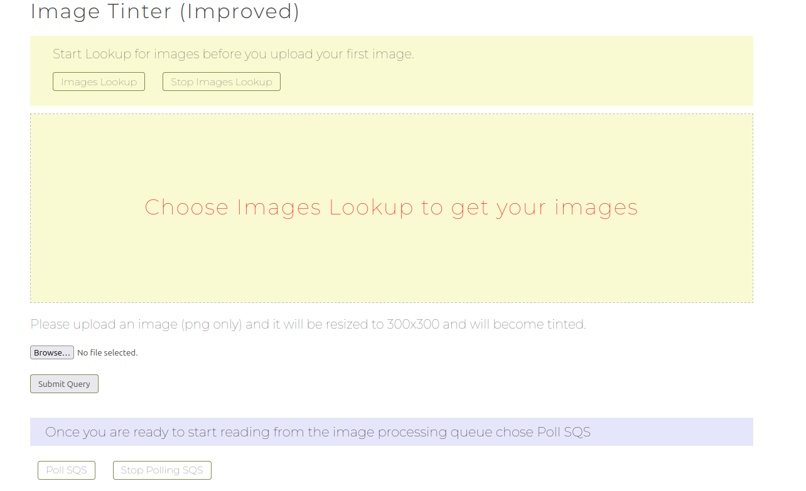

### Before SQS Polling

After the image was uploaded, it was stored in Amazon S3 and a message was placed in the SQS queue.

The image remained unprocessed until polling started.


### After SQS Polling

After selecting `Poll SQS`, the application server received and processed the queued message.

The image was resized, tinted, and saved back to Amazon S3.

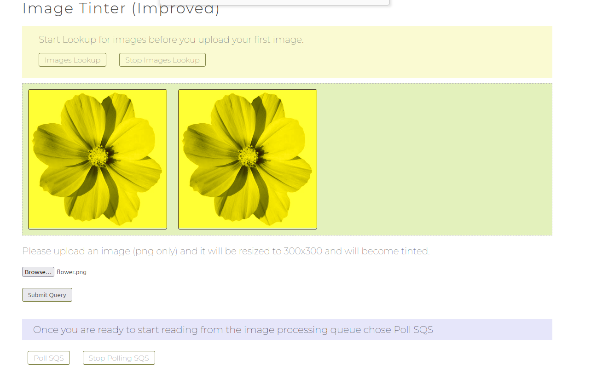

---

## Final Result

The decoupled architecture was successfully implemented and tested.

```text
Browser
   ↓
Web Server
   ↓
Amazon S3
   ↓
Amazon SNS
   ├── Email Notification
   └── Amazon SQS
           ↓
    Application Server
           ↓
    Processed Image in S3
```

The final lab score was:

```text
30/30
```

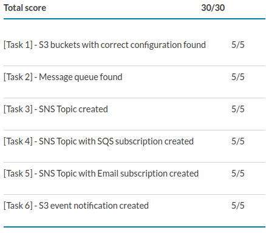

## Key Takeaways

- Tight coupling creates direct dependencies between application components.
- Amazon SQS stores messages until consumers are ready to process them.
- Amazon SNS can distribute one event to multiple subscribers.
- S3 event notifications can automatically start asynchronous workflows.
- Decoupled applications provide better reliability, scalability, and availability.
- If the application server becomes unavailable, messages remain safely stored in SQS.
- Polling allows the application server to process queued messages when it is ready.

## Security Notes

- Sensitive AWS Account IDs were removed from public screenshots.
- Public IP addresses were removed or hidden where necessary.
- SQS queue URLs and resource ARNs were redacted where necessary.
- No AWS credentials or private keys were committed to the repository.
- Bucket access was restricted to a specific source IP during the lab.

## Project Structure

```text
09-decoupled-applications-sqs-sns/
├── README.md
└── screenshots/
    ├── 01-lab-ide-open.png
    ├── 02-phase1-bucket-permissions.png
    ├── 03-phase1-bucket-policy.png
    ├── 04-phase1-image-tinter-app.png
    ├── 05-phase1-processed-image.png
    ├── 06-sqs-imageapp-queue.png
    ├── 08-phase2-bucket-permissions.png
    ├── 09-phase2-bucket-policy.png
    ├── 10-s3-event-notification-created.png
    ├── 11-sqs-sns-subscription.png
    ├── 12-sns-email-subscription-confirmed.png
    ├── 13-phase2-image-tinter-improved.png
    ├── 14-phase2-image-uploaded-before-polling.png
    ├── 15-phase2-processed-images.png
    └── 16-final-score.png
```
EOF