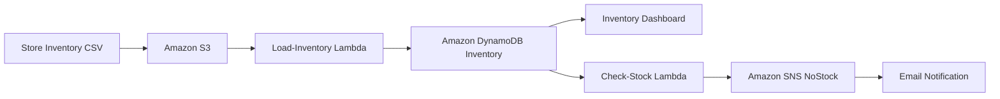

# Serverless Inventory Architecture on AWS

## Project Overview

This project implements a serverless inventory-tracking system on AWS.

Inventory CSV files uploaded to Amazon S3 are automatically processed by an AWS Lambda function. The records are stored in an Amazon DynamoDB table and displayed through a web-based inventory dashboard.

A second Lambda function is invoked through DynamoDB Streams. When an inventory item has a count of zero, the function publishes an alert to an Amazon SNS topic, which sends an email notification.

No Amazon EC2 instances are required.

## Objectives

- Implement a serverless architecture on AWS
- Invoke AWS Lambda from Amazon S3 events
- Store inventory data in Amazon DynamoDB
- Invoke Lambda through DynamoDB Streams
- Send low-stock notifications with Amazon SNS
- View inventory through a Cognito-enabled dashboard

## AWS Services Used

- AWS Lambda
- Amazon S3
- Amazon DynamoDB
- DynamoDB Streams
- Amazon SNS
- Amazon Cognito
- AWS IAM

## Architecture



## Workflow

1. A store uploads an inventory CSV file to Amazon S3.
2. The S3 object-created event invokes the `Load-Inventory` Lambda function.
3. The function reads the CSV file and inserts the records into DynamoDB.
4. DynamoDB Streams invokes the `Check-Stock` Lambda function.
5. The function checks whether an inventory count equals zero.
6. If an item is out of stock, the function publishes a message to Amazon SNS.
7. Amazon SNS sends an inventory alert by email.
8. The dashboard retrieves and displays inventory data from DynamoDB.

## Lambda Functions

### Load-Inventory

File: `lambda/load_inventory.py`

Responsibilities:

- Receives an Amazon S3 object-created event
- Downloads and reads the uploaded CSV file
- Inserts `Store`, `Item`, and `Count` values into DynamoDB

### Check-Stock

File: `lambda/check_stock.py`

Responsibilities:

- Receives records from DynamoDB Streams
- Checks newly inserted inventory values
- Detects records where `Count` equals zero
- Publishes alerts to the `NoStock` SNS topic

## Example Inventory File

```csv
store,item,count
Berlin,Echo Dot,12
Berlin,Echo (2nd Gen),19
Berlin,Echo Show,18
Berlin,Echo Plus,0
Berlin,Echo Look,10
Berlin,Amazon Tap,15
```

## Implementation Summary

- Created the `Load-Inventory` Lambda function with Python 3.12.
- Configured an S3 object-created event notification.
- Loaded CSV inventory data into the DynamoDB `Inventory` table.
- Created the `NoStock` SNS topic and confirmed an email subscription.
- Created the `Check-Stock` Lambda function.
- Connected DynamoDB Streams to the `Check-Stock` function.
- Verified inventory alerts through email notifications.

## Project Structure

```text
10-serverless-architecture/
├── README.md
├── lambda/
│   ├── check_stock.py
│   └── load_inventory.py
└── screenshots/
```

## Security Notes

- AWS account IDs and resource ARNs are hidden from public screenshots.
- Email addresses and Cognito identity information are not exposed.
- Lambda functions use predefined IAM execution roles.
- No credentials or secrets are stored in this repository.

## Result

```text
Final score: 40/40
```

## Key Learning Outcomes

- Event-driven AWS architecture
- Serverless application design
- S3 event notifications
- Lambda integrations
- DynamoDB Streams
- SNS email notifications
- IAM execution roles

## Screenshots

### 1. Load-Inventory Lambda Function Created


### 2. Load-Inventory Code Deployed


### 3. S3 Inventory Bucket


### 4. S3 Event Notification


### 5. Inventory File Uploaded


### 6. Inventory Dashboard


### 7. DynamoDB Inventory Items


### 8. NoStock SNS Topic


### 9. SNS Email Subscription Confirmed


### 10. Check-Stock Lambda Function Created


### 11. Check-Stock Code Deployed


### 12. DynamoDB Trigger Added


### 13. Second Inventory File Uploaded


### 14. Final Inventory Dashboard


### 15. Karachi Inventory Dashboard


### 16. Inventory Alert Email


### 17. Final Lab Score


