# Serverless Inventory Architecture on AWS

## Project Overview

This project implements a serverless inventory-tracking system on AWS.

Inventory CSV files uploaded to Amazon S3 are automatically processed by an AWS Lambda function. The records are stored in an Amazon DynamoDB table and displayed through a web-based inventory dashboard.

A second Lambda function is invoked through DynamoDB Streams. When an inventory item has a count of zero, the function publishes an alert to an Amazon SNS topic, which sends an email notification.

No Amazon EC2 instances are required.

## Objectives

- Implement a serverless architecture on AWS
- Invoke AWS Lambda from Amazon S3 events
- Store inventory data in Amazon DynamoDB
- Invoke Lambda through DynamoDB Streams
- Send low-stock notifications with Amazon SNS
- View inventory through a Cognito-enabled dashboard

## AWS Services Used

- AWS Lambda
- Amazon S3
- Amazon DynamoDB
- DynamoDB Streams
- Amazon SNS
- Amazon Cognito
- AWS IAM

## Architecture

```mermaid
flowchart LR
    store["Store Inventory CSV"] --> s3["Amazon S3"]
    s3 -->|Object Created Event| load["Load-Inventory Lambda"]
    load --> ddb["Amazon DynamoDB Inventory Table"]
    ddb --> dashboard["Inventory Dashboard"]
    ddb -->|DynamoDB Stream| check["Check-Stock Lambda"]
    check -->|Count = 0| sns["Amazon SNS NoStock Topic"]
    sns --> email["Email Notification"]
Workflow
A store uploads an inventory CSV file to an S3 bucket.
The S3 object-created event invokes the Load-Inventory Lambda function.
The function downloads and reads the CSV file.
Each inventory record is inserted into the DynamoDB Inventory table.
DynamoDB Streams invokes the Check-Stock Lambda function.
The function checks the inventory count for each new record.
If an item count is zero, a message is published to the NoStock SNS topic.
Amazon SNS sends an Inventory Alert! email.
The inventory dashboard retrieves and displays data from DynamoDB.
Lambda Functions
Load-Inventory

File:

lambda/load_inventory.py

Responsibilities:

Receives an Amazon S3 object-created event
Downloads the uploaded CSV file
Reads the inventory records
Inserts Store, Item, and Count into DynamoDB
Check-Stock

File:

lambda/check_stock.py

Responsibilities:

Receives records from DynamoDB Streams
Checks newly inserted inventory values
Detects records where Count equals zero
Publishes an alert to the NoStock SNS topic
Example Inventory File
store,item,count
Berlin,Echo Dot,12
Berlin,Echo (2nd Gen),19
Berlin,Echo Show,18
Berlin,Echo Plus,0
Berlin,Echo Look,10
Berlin,Amazon Tap,15
Implementation Summary
1. Load-Inventory Lambda

A Python Lambda function was created with the existing Lambda-Load-Inventory-Role.

Python 3.12 was used because Python 3.8 was no longer available when the lab was completed.

2. S3 Event Notification

An inventory S3 bucket was created and configured with an event notification:

Event: All object create events
Destination: Load-Inventory Lambda
3. DynamoDB Data Loading

Inventory CSV files were uploaded to S3. The Lambda function processed the files and inserted their records into the Inventory DynamoDB table.

4. SNS Email Subscription

A standard SNS topic named NoStock was created. An email endpoint was subscribed and confirmed.

5. Check-Stock Lambda

A second Python Lambda function was created with the existing Lambda-Check-Stock-Role.

The function was connected to the Inventory table through DynamoDB Streams.

6. Final Test

Multiple inventory files were uploaded for Berlin, Calcutta, and Karachi.

The dashboard displayed inventory records from all stores. When an item had zero inventory, an email was successfully received.

Example notification:

Subject: Inventory Alert!

Karachi is out of stock of Echo Plus
Project Structure
10-serverless-architecture/
├── README.md
├── lambda/
│   ├── check_stock.py
│   └── load_inventory.py
└── screenshots/
Security Notes
AWS account IDs and resource ARNs are hidden from public screenshots.
Email addresses and Cognito identity information are not exposed.
Lambda functions use predefined IAM execution roles.
No credentials or secrets are stored in this repository.
Result

The serverless architecture was successfully implemented and tested.

Final score: 40/40
Key Learning Outcomes
Event-driven AWS architecture
Serverless application design
S3 event notifications
Lambda integration with AWS services
DynamoDB Streams
SNS email notifications
IAM execution roles

## Screenshots

### 1. Load-Inventory Lambda Function Created

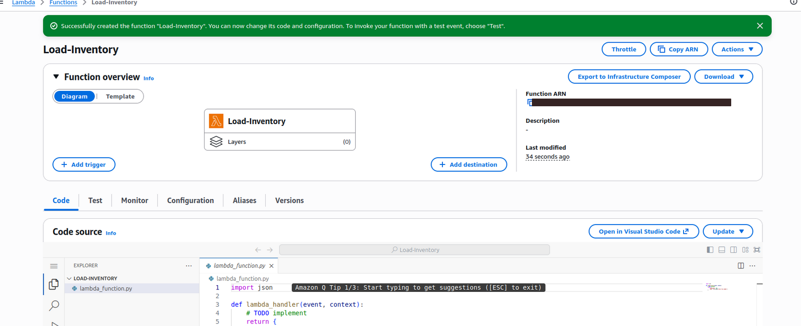

### 2. Load-Inventory Code Deployed

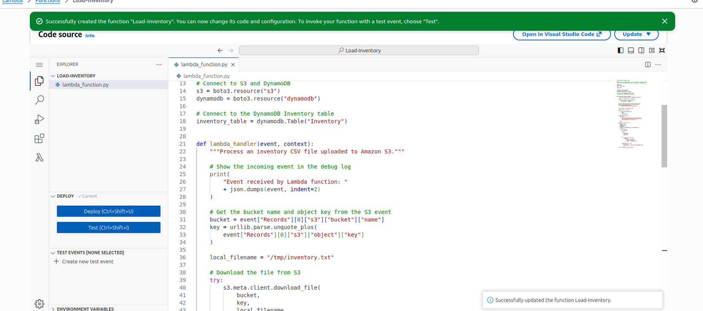

### 3. S3 Inventory Bucket

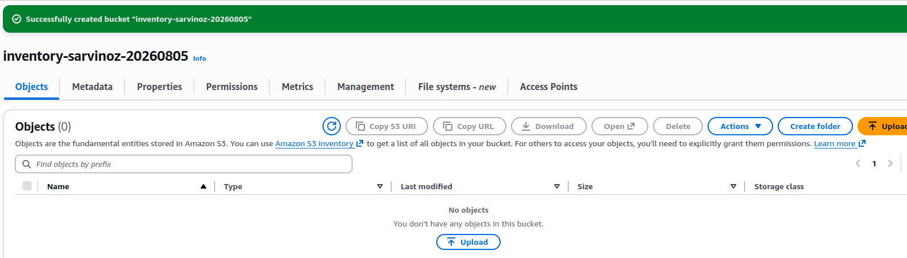

### 4. S3 Event Notification

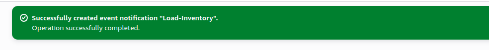

### 5. Inventory File Uploaded

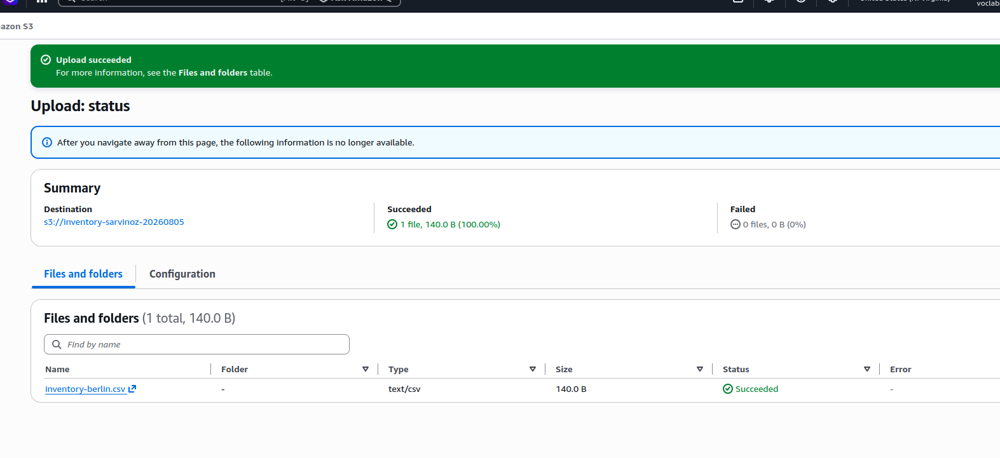

### 6. Inventory Dashboard

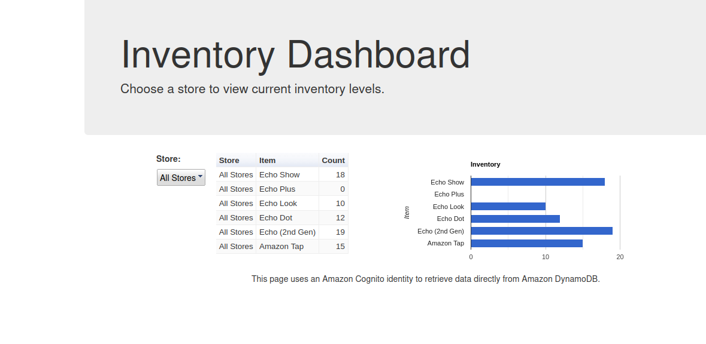

### 7. DynamoDB Inventory Items

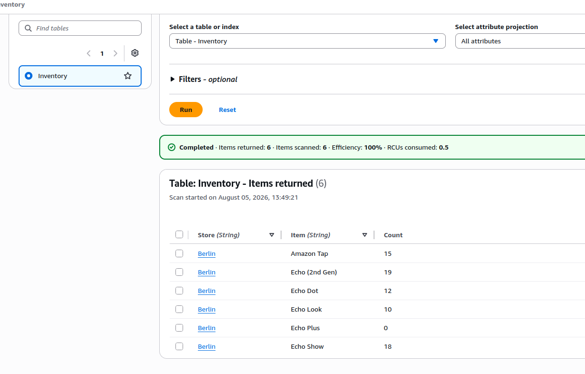

### 8. NoStock SNS Topic

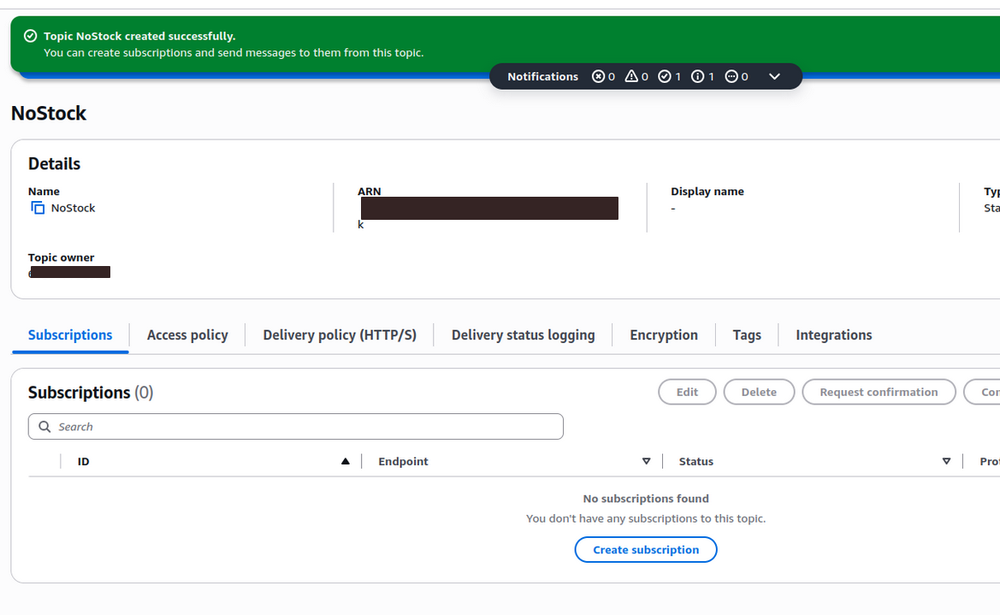

### 9. SNS Email Subscription Confirmed

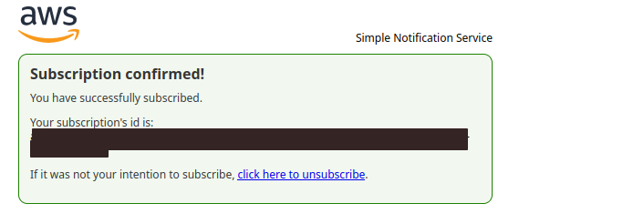

### 10. Check-Stock Lambda Function Created

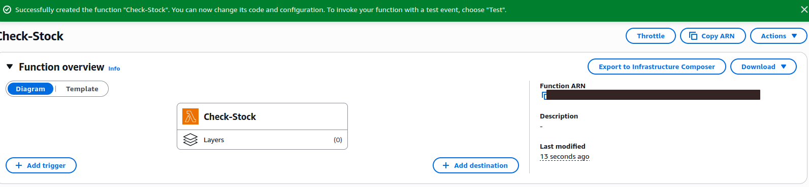

### 11. Check-Stock Code Deployed

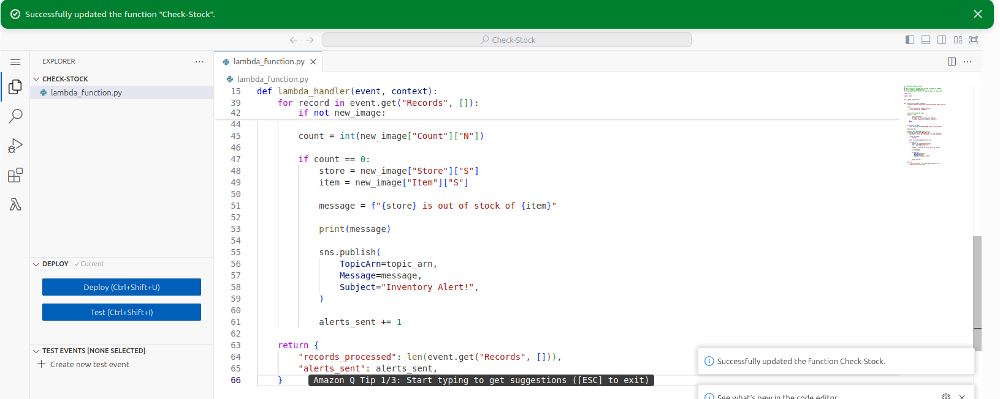

### 12. DynamoDB Trigger Added

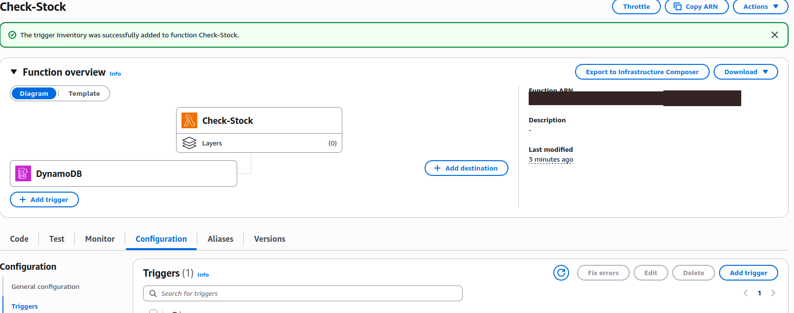

### 13. Second Inventory File Uploaded

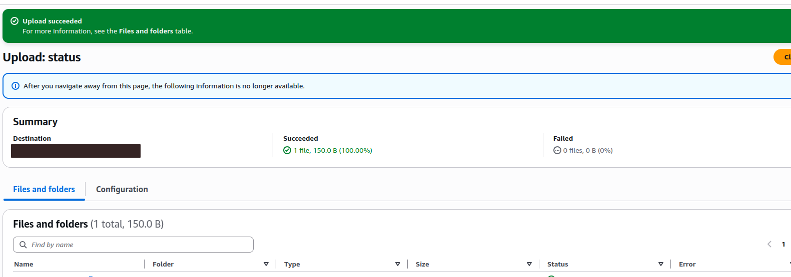

### 14. Final Inventory Dashboard

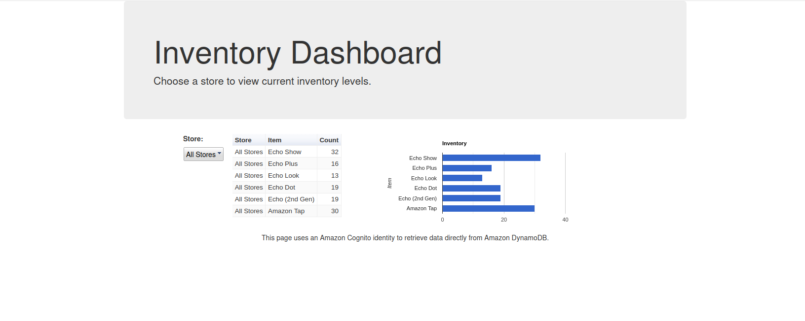

### 15. Karachi Inventory Dashboard

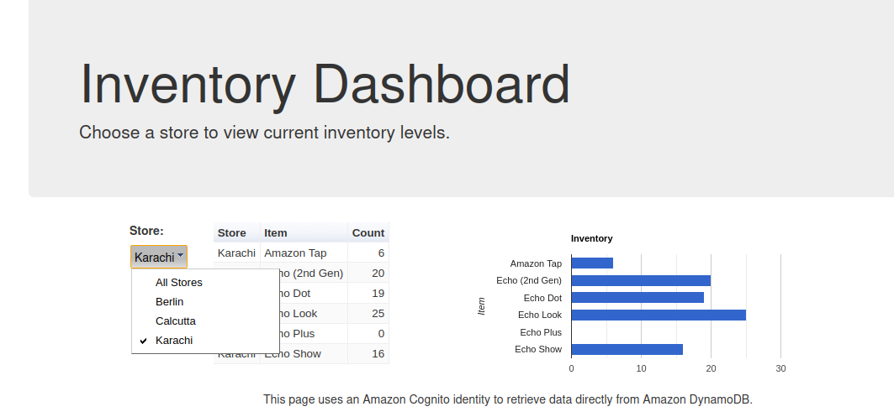

### 16. Inventory Alert Email

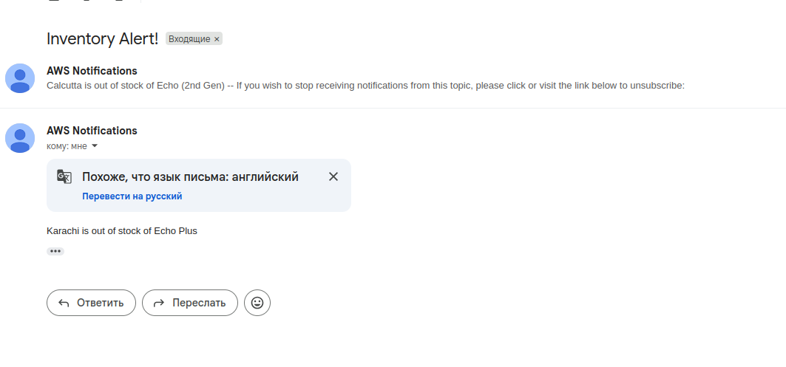

### 17. Final Lab Score

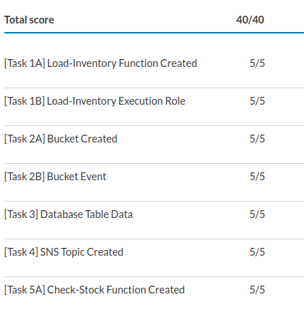
