# Serverless Daily Sales Report for the Café

## Project Overview

This challenge lab implements a serverless architecture that automatically generates and emails a daily café sales report.

Instead of running a resource-intensive cron job on the production EC2 web server, the solution uses AWS Lambda, Amazon RDS, Amazon SNS, and Amazon EventBridge.

## Objectives

- Connect an AWS Lambda function securely to Amazon RDS
- Deploy two Python-based Lambda functions
- Extract and format daily café sales data
- Send reports through Amazon SNS
- Confirm an email subscription
- Automate daily execution with Amazon EventBridge
- Monitor executions with Amazon CloudWatch Logs

## AWS Services Used

- AWS Lambda
- Amazon RDS
- Amazon VPC
- Amazon SNS
- Amazon EventBridge
- Amazon CloudWatch Logs
- AWS IAM
- EC2 Security Groups

## Architecture

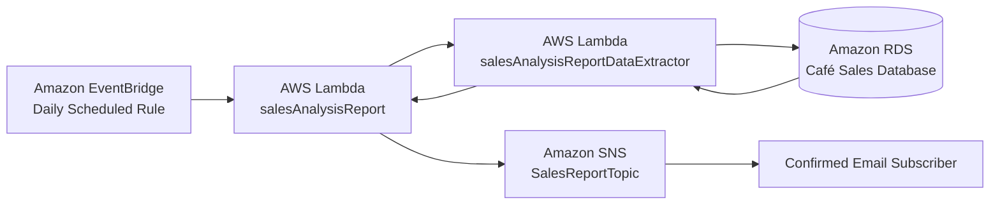

## Workflow

1. Amazon EventBridge invokes `salesAnalysisReport` according to a daily schedule.
2. `salesAnalysisReport` invokes `salesAnalysisReportDataExtractor`.
3. The DataExtractor function connects to the private Amazon RDS database.
4. Sales information is queried and returned to the reporting function.
5. The reporting function formats the daily sales report.
6. The report is published to `SalesReportTopic`.
7. Amazon SNS sends the report to the confirmed email subscriber.

## Network and Security Configuration

The `salesAnalysisReportDataExtractor` function was connected to:

- VPC: `Lab VPC`
- Subnets: `Private subnet 1` and `Private subnet 2`
- Security group: `LambdaSG`

The database security group was updated with this inbound rule:

```text
Type: MySQL/Aurora
Protocol: TCP
Port: 3306
Source: LambdaSG
```

This configuration permits database access from the Lambda security group without exposing MySQL publicly.

## Lambda Functions

### salesAnalysisReportDataExtractor

This Lambda function connects to Amazon RDS and retrieves café sales information.

```text
Runtime: Python 3.11
Handler: salesAnalysisReportDataExtractor.lambda_handler
Memory: 128 MB
Timeout: 30 seconds
Execution role: salesAnalysisReportDERole
VPC enabled: Yes
```

The deployment package includes a `package` folder containing required Python dependencies such as the database client library.

### salesAnalysisReport

This Lambda function generates the report and publishes it to Amazon SNS.

```text
Runtime: Python 3.11
Handler: salesAnalysisReport.lambda_handler
Memory: 128 MB
Timeout: 30 seconds
Execution role: salesAnalysisReportRole
```

Environment variable:

```text
Key: topicARN
Value: ARN of SalesReportTopic
```

## Amazon SNS Configuration

```text
Topic name: SalesReportTopic
Display name: Sales Report Topic
Type: Standard
Subscription protocol: Email
Subscription status: Confirmed
```

An SNS email subscription must be confirmed before reports can be delivered.

## Amazon EventBridge Configuration

```text
Rule name: DailySalesReportRule
Status: Enabled
Type: Scheduled Standard
Cron expression: cron(50 4 * * ? *)
Time zone: UTC
Target: salesAnalysisReport
Execution role: mySchedulerRole
```

## Testing and Troubleshooting

The `salesAnalysisReport` function was tested with a default Lambda test event.

The successful test confirmed that the system could:

- Invoke the DataExtractor Lambda function
- Connect to Amazon RDS
- Retrieve café sales data
- Generate the daily report
- Publish the report to Amazon SNS
- Deliver the report by email

Amazon CloudWatch Logs were used to inspect Lambda executions and troubleshoot scheduled invocations.

## Project Structure

```text
12-serverless-sales-report-challenge/
├── README.md
└── screenshots/
    ├── 01-lambda-security-group.png
    ├── 02-database-sg-lambda-rule.png
    ├── 03-data-extractor-lambda-created.png
    ├── 04-data-extractor-code-uploaded.png
    ├── 05-data-extractor-runtime-settings.png
    ├── 06-sales-report-lambda-created.png
    ├── 07-sales-report-code-uploaded.png
    ├── 08-sales-report-runtime-settings.png
    ├── 09-sales-report-sns-topic.png
    ├── 10-topic-arn-environment-variable.png
    ├── 11-sns-email-subscription-confirmed.png
    ├── 12-daily-sales-report-email.png
    ├── 13-eventbridge-daily-rule.png
    └── 14-final-score.png
```

## Screenshots

### 1. Lambda Security Group

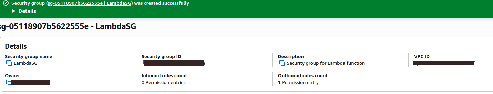

### 2. Database Security Group Rule

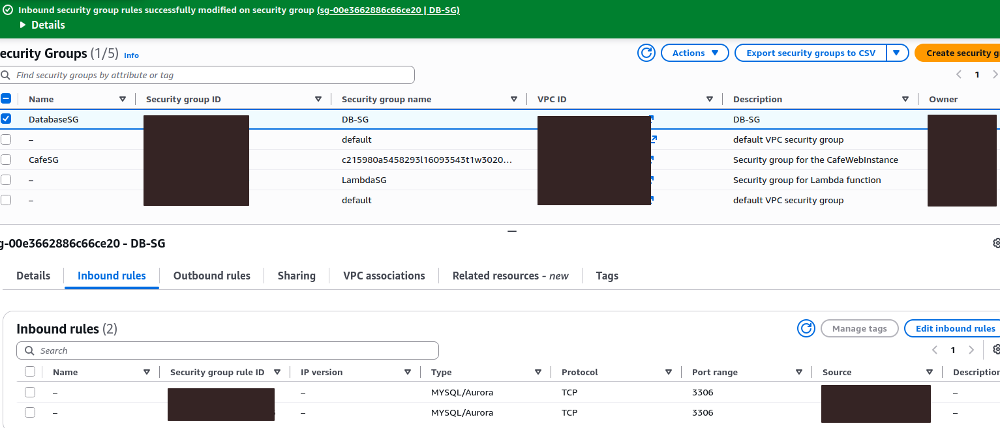

### 3. DataExtractor Lambda Function

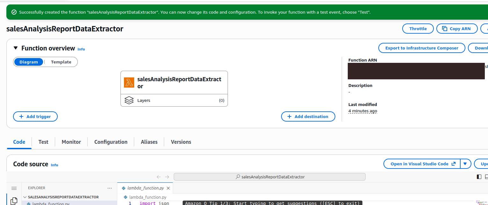

### 4. DataExtractor Code Package

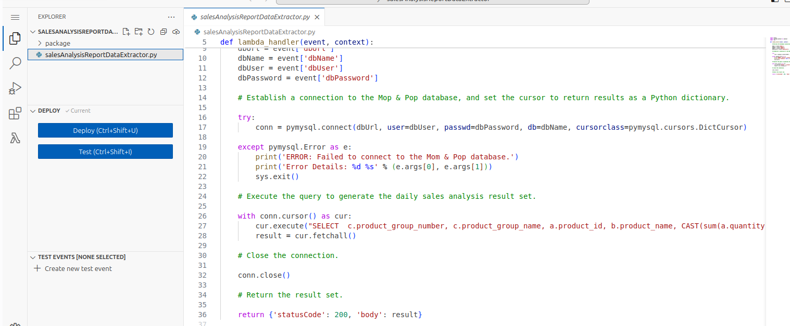

### 5. DataExtractor Runtime Settings

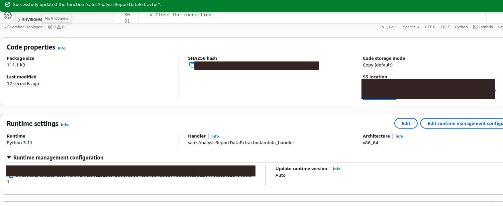

### 6. Sales Report Lambda Function

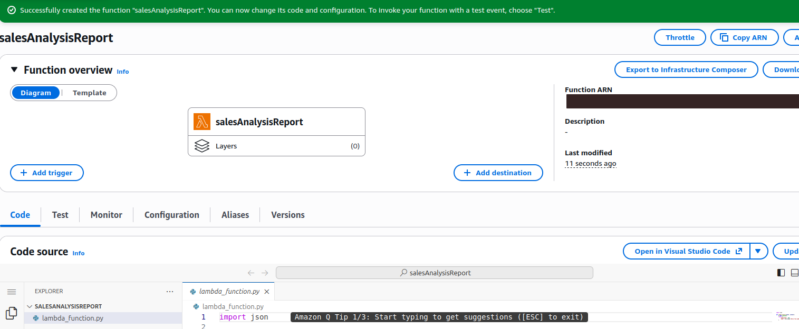

### 7. Sales Report Code Package

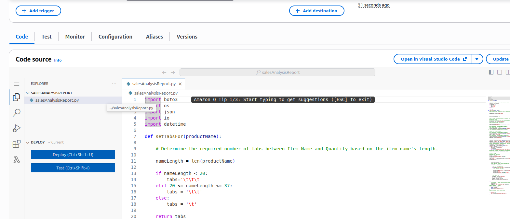

### 8. Sales Report Runtime Settings

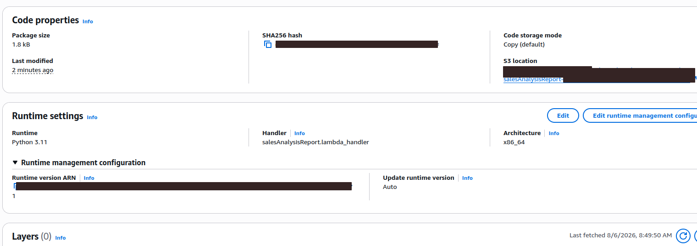

### 9. Amazon SNS Topic

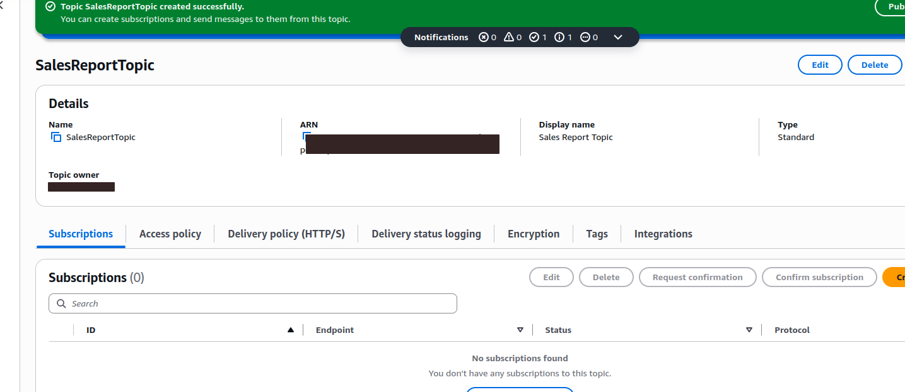

### 10. Topic ARN Environment Variable

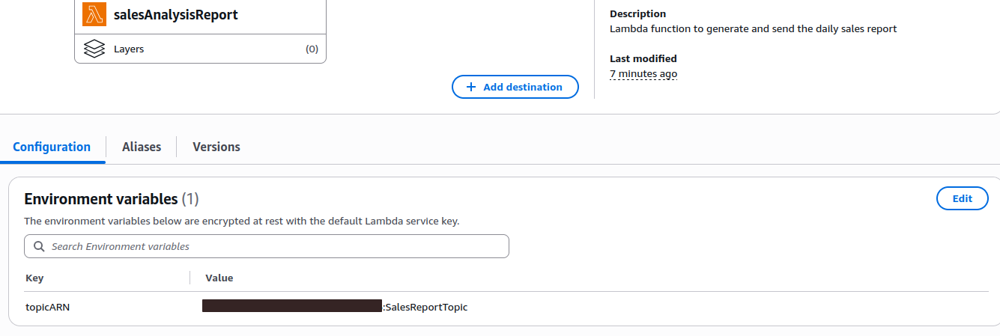

### 11. Confirmed Email Subscription

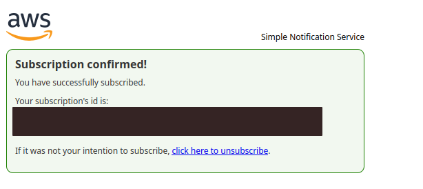

### 12. Daily Sales Analysis Report

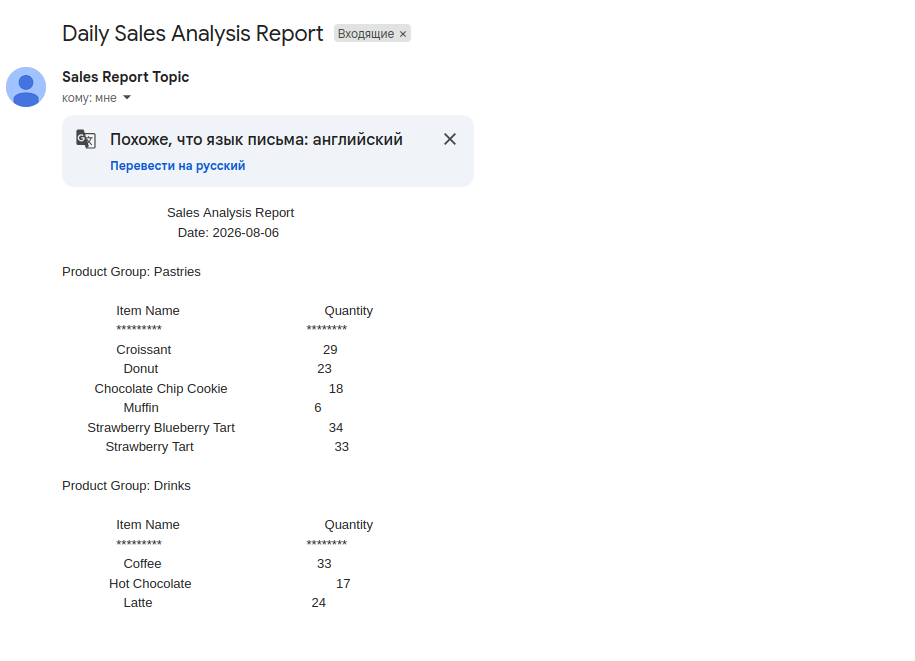

### 13. EventBridge Daily Rule

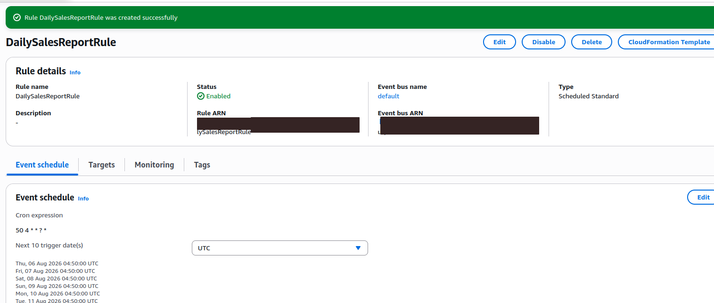

### 14. Final Score

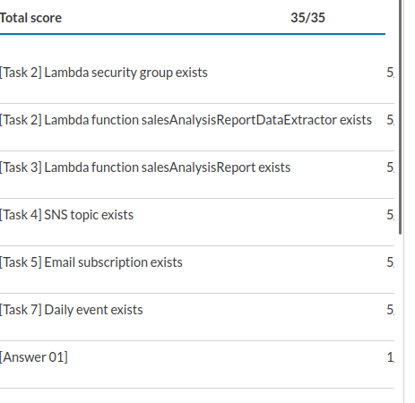

## Key Learning Outcomes

- Designing a serverless event-driven architecture
- Connecting Lambda to private VPC resources
- Configuring security-group-to-security-group access
- Packaging Python dependencies for Lambda
- Invoking one Lambda function from another
- Publishing reports through Amazon SNS
- Automating execution with EventBridge cron rules
- Troubleshooting Lambda with CloudWatch Logs

## Result

The complete serverless reporting workflow was successfully implemented and validated.

```text
Final score: 35/35
```
