# Hybrid Storage and Data Migration with AWS S3 File Gateway

## Project Overview

This project demonstrates a hybrid storage and data migration architecture using **AWS Storage Gateway S3 File Gateway**, **Amazon S3**, **NFS**, and **Amazon S3 Cross-Region Replication**.

An Amazon EC2 Linux instance simulates an on-premises file server containing image files. An S3 File Gateway provides an NFS file share that is mounted on the Linux server. Files copied into the mounted directory are stored as objects in a source Amazon S3 bucket.

Amazon S3 Cross-Region Replication automatically copies the objects from the source bucket in the **US East (Ohio)** Region to a destination bucket in the **US West (Oregon)** Region.

The lab was completed successfully with a final score of **40/40**.

---

## Objectives

- Create source and destination Amazon S3 buckets
- Enable versioning on both S3 buckets
- Configure Amazon S3 Cross-Region Replication
- Test replication between AWS Regions
- Deploy an Amazon S3 File Gateway appliance on EC2
- Attach local cache storage to the gateway
- Create an NFS file share
- Mount the NFS file share on a Linux server
- Migrate local files from Linux to Amazon S3
- Verify replicated objects in the destination bucket

---

## AWS Services Used

| AWS Service | Purpose |
|---|---|
| Amazon S3 | Stores migrated files as objects |
| AWS Storage Gateway | Provides the S3 File Gateway |
| Amazon EC2 | Hosts the gateway appliance and Linux server |
| Amazon EBS | Provides root and cache storage for the gateway |
| AWS IAM | Grants the gateway access to Amazon S3 |
| AWS Systems Manager | Provides browser-based access to the Linux server |
| S3 Cross-Region Replication | Replicates objects between AWS Regions |

---

## Architecture

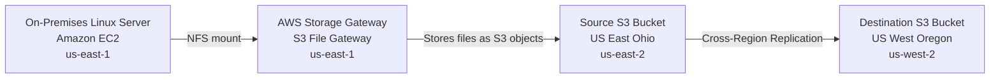

---

## Data Migration Workflow

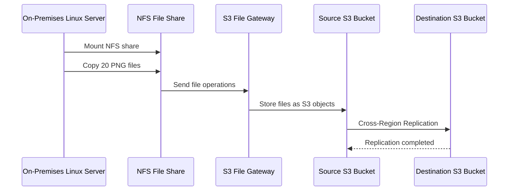

---

## Regional Architecture

| Resource | AWS Region |
|---|---|
| On-Premises Linux Server | US East (N. Virginia) — `us-east-1` |
| S3 File Gateway Appliance | US East (N. Virginia) — `us-east-1` |
| Source S3 Bucket | US East (Ohio) — `us-east-2` |
| Destination S3 Bucket | US West (Oregon) — `us-west-2` |

---

## Amazon S3 Configuration

### Source Bucket

```text
Bucket name: sarvinoz-storage-gateway-source-2026
Region: US East (Ohio) — us-east-2
Versioning: Enabled
Purpose: Receives migrated files from the S3 File Gateway
```

### Destination Bucket

```text
Bucket name: sarvinoz-storage-gateway-destination-2026
Region: US West (Oregon) — us-west-2
Versioning: Enabled
Purpose: Receives replicated objects from the source bucket
```

Versioning was enabled on both buckets because Amazon S3 replication requires versioning on the source and destination buckets.

---

## Cross-Region Replication

The following replication rule was configured on the source bucket:

```text
Rule name: crr-full-bucket
Status: Enabled
Scope: Entire bucket
Destination: sarvinoz-storage-gateway-destination-2026
Destination Region: us-west-2
IAM role: S3-CRR-Role
```

A test file named `crr-test.txt` was uploaded to the source bucket.

The file appeared automatically in the destination bucket, confirming that Cross-Region Replication was working correctly.

---

## S3 File Gateway Configuration

The S3 File Gateway appliance was deployed as an Amazon EC2 instance.

### EC2 Configuration

```text
Instance name: File Gateway Appliance
AMI: AWS Storage Gateway File S3 Gateway
Instance type: m5.xlarge
Key pair: vockey
```

### Network Configuration

```text
VPC: On-Prem-VPC
Subnet: On-Prem-Subnet
Auto-assign public IP: Enabled
```

### Security Groups

```text
FileGatewayAccess
OnPremSshAccess
```

The security groups allowed the traffic required for gateway activation, NFS connectivity, HTTPS communication, DNS, NTP, and SSH access.

### Storage Configuration

```text
Root volume: 80 GiB gp3
Cache volume: 150 GiB gp3
```

The additional 150 GiB EBS volume was configured as local cache storage for the S3 File Gateway.

---

## NFS File Share Configuration

An NFS file share was created and connected to the source S3 bucket.

```text
Gateway: File Gateway
S3 bucket: sarvinoz-storage-gateway-source-2026
IAM role: FgwRole
File share protocol: NFS
```

The file share provided a standard Linux filesystem interface while storing the data as Amazon S3 objects.

---

## Linux Server Data

The Linux server contained 20 PNG image files in the following directory:

```bash
ls /media/data
```

Example output:

```text
1.png
2.png
3.png
...
20.png
```

---

## Mounting the NFS File Share

A local mount directory was created:

```bash
sudo mkdir -p /mnt/nfs/s3
```

The NFS file share was mounted with:

```bash
sudo mount -t nfs -o nolock,hard \
<FILE_GATEWAY_PRIVATE_IP>:/sarvinoz-storage-gateway-source-2026 \
/mnt/nfs/s3
```

The mount was verified using:

```bash
df -h
```

Expected mounted path:

```text
/mnt/nfs/s3
```

---

## Migrating Files to Amazon S3

The 20 PNG files were copied from the Linux server into the mounted NFS file share:

```bash
cp -v /media/data/*.png /mnt/nfs/s3
```

The copied files were verified with:

```bash
ls /mnt/nfs/s3
```

AWS Storage Gateway automatically stored the copied files as objects in the source S3 bucket.

---

## Migration Flow

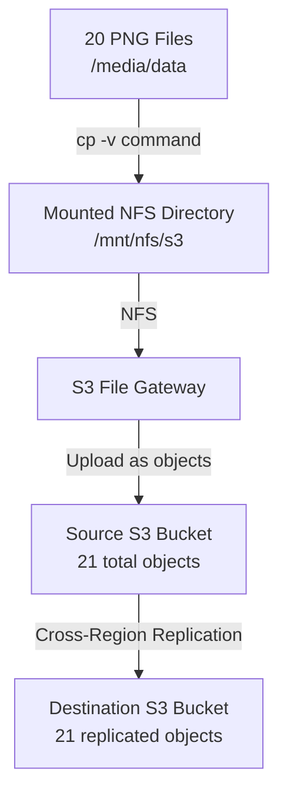

---

## Verification

After migration, the source bucket contained:

```text
20 PNG image files
1 replication test file
21 total objects
```

The destination bucket also contained all 21 objects after Cross-Region Replication completed.

This confirmed that:

- The Linux server successfully mounted the NFS file share
- Files were successfully migrated through the S3 File Gateway
- Files were stored in the source Amazon S3 bucket
- Cross-Region Replication copied the objects to the destination bucket

---

## Security Considerations

- Only the required security groups were attached to the gateway appliance
- NFS access was controlled through the lab-provided security group
- SSH access was restricted through the `OnPremSshAccess` security group
- The gateway used a dedicated IAM role to access the source S3 bucket
- S3 bucket versioning was enabled for replication and recovery
- No sensitive data was used for replication testing
- Public IP addresses, instance IDs, DNS names, and gateway IDs should be hidden in public screenshots

---

## Project Structure

```text
13-hybrid-storage-s3-file-gateway/
├── README.md
└── screenshots/
    ├── 01-source-bucket-created.png
    ├── 02-destination-bucket-created.png
    ├── 03-cross-region-replication-rule.png
    ├── 04-crr-test-source-object.png
    ├── 05-crr-test-destination-object.png
    ├── 06-file-gateway-instance-running.png
    ├── 07-file-gateway-activated.png
    ├── 08-file-gateway-cache-configured.png
    ├── 09-nfs-file-share-created.png
    ├── 10-linux-files-before-migration.png
    ├── 11-nfs-share-mounted.png
    ├── 12-files-copied-to-nfs.png
    ├── 13-source-bucket-migrated-files.png
    ├── 14-destination-bucket-replicated-files.png
    └── 15-final-score.png
```

---

## Result

The hybrid storage architecture was successfully implemented.

The Linux server mounted an NFS file share provided by AWS Storage Gateway. Twenty local image files were migrated into the source Amazon S3 bucket and replicated automatically to a destination bucket in another AWS Region.

```text
Final score: 40/40
```

---

## Key Learning Outcomes

- Understanding hybrid cloud storage architecture
- Deploying an S3 File Gateway appliance on Amazon EC2
- Configuring local cache storage for Storage Gateway
- Creating and mounting an NFS file share
- Migrating Linux filesystem data into Amazon S3
- Enabling Amazon S3 bucket versioning
- Configuring Cross-Region Replication
- Verifying replicated objects across AWS Regions
- Using AWS Systems Manager Session Manager
- Applying IAM roles and security groups to hybrid storage workloads

---

## Screenshots

### 1. Source S3 Bucket Created

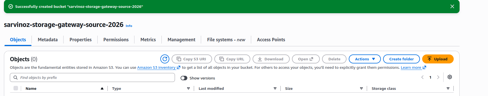

### 2. Destination S3 Bucket Created

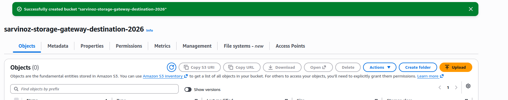

### 3. Cross-Region Replication Rule

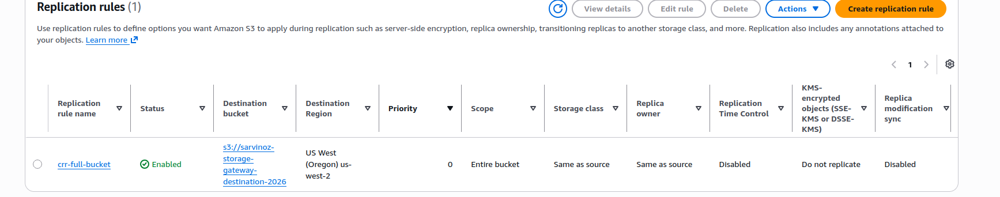

### 4. Replication Test in Source Bucket

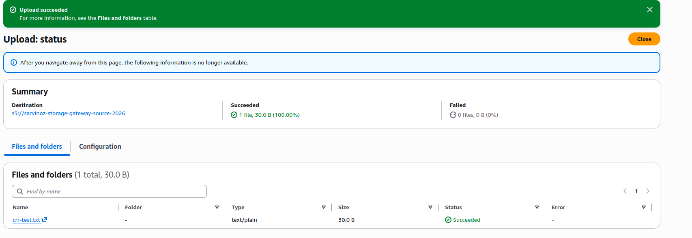

### 5. Replication Test in Destination Bucket

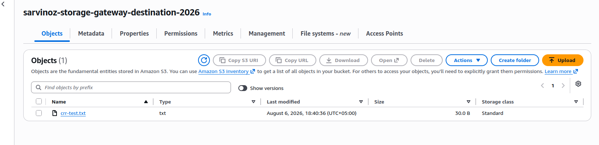

### 6. File Gateway EC2 Instance Running

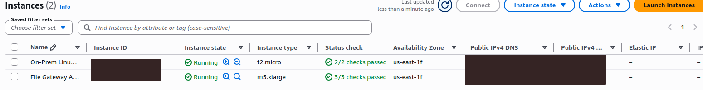

### 7. File Gateway Activated

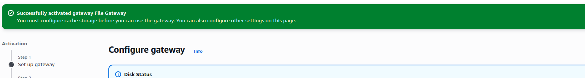

### 8. File Gateway Cache Configured

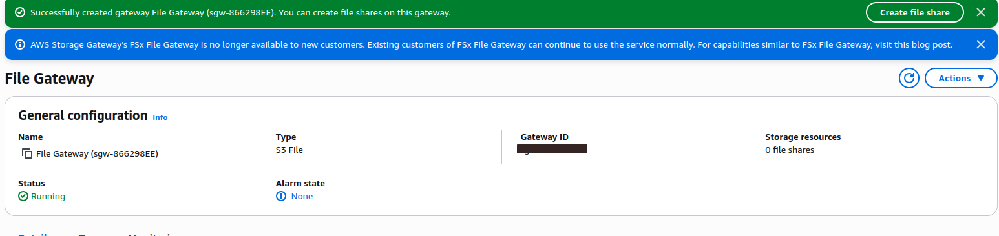

### 9. NFS File Share Created

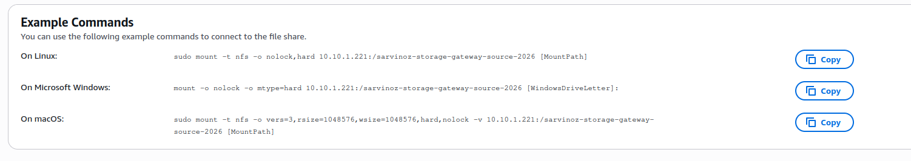

### 10. Linux Files Before Migration

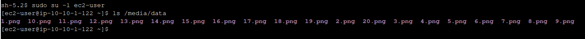

### 11. NFS Share Mounted

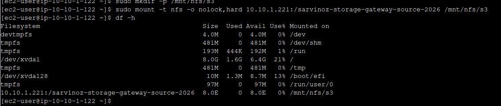

### 12. Files Copied to NFS

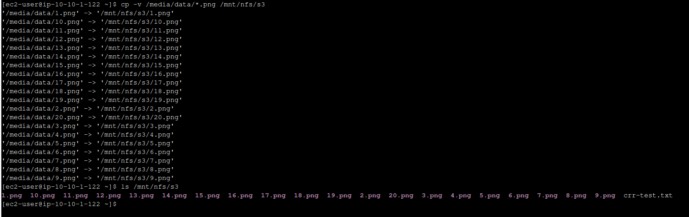

### 13. Migrated Files in Source Bucket

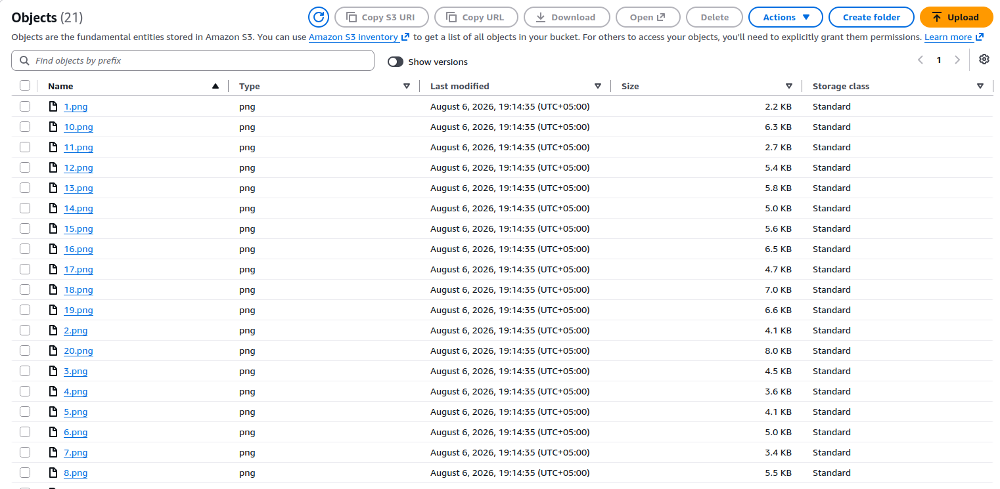

### 14. Replicated Files in Destination Bucket

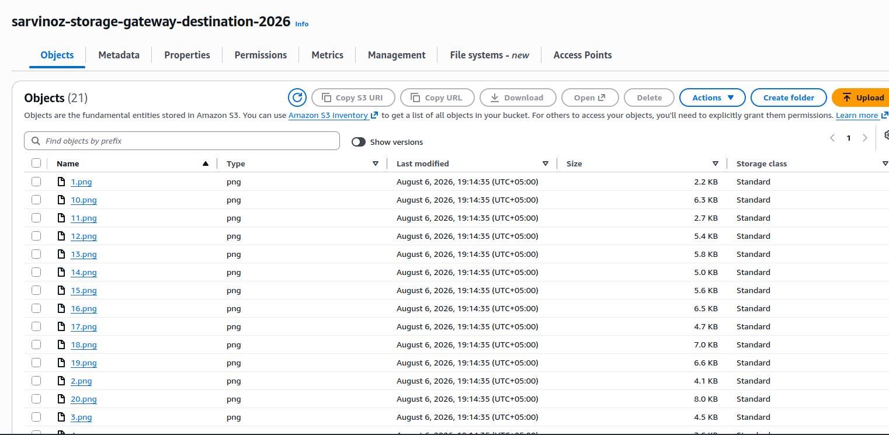

### 15. Final Lab Score

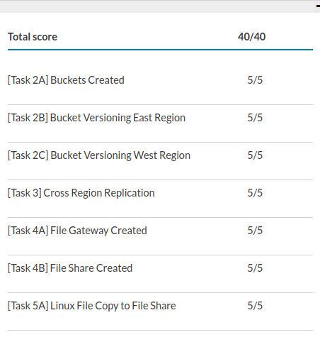
